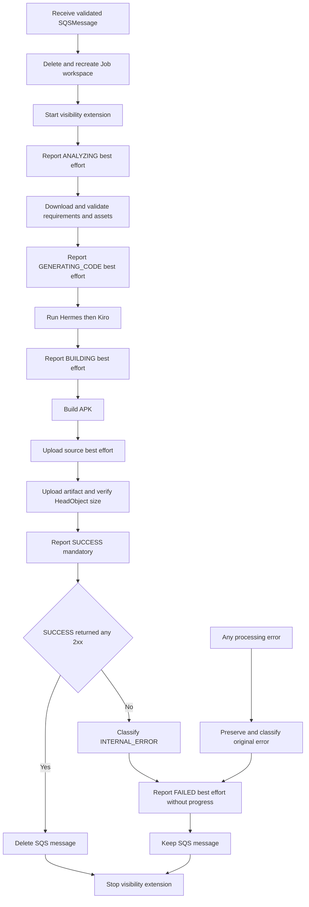
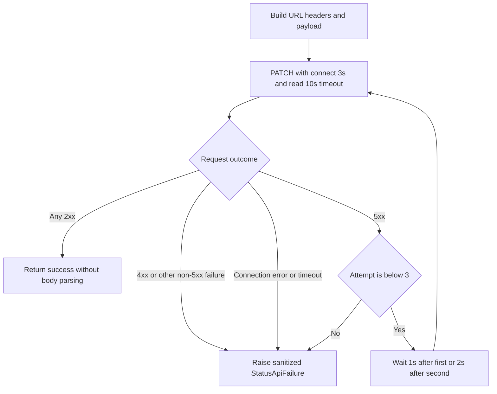

# Business Logic Model - ai-worker Status API Target

## 1. Model Principles

- A processing attempt begins only with a validated `SQSMessage`.
- Every delivery is processed from a clean workspace; there is no status read or resume point.
- Local phase progression and Backend-observed status can diverge when a best-effort PATCH fails.
- Status transport raises a typed final failure; the orchestrator selects best-effort or mandatory behavior.
- Artifact verification and Backend SUCCESS must both complete before SQS acknowledgment.

## 2. Per-Delivery Processing Flow



### Text Alternative

```text
Receive validated message and recreate the Job workspace.
Start visibility extension and attempt ANALYZING.
Download inputs, attempt GENERATING_CODE, run Hermes and Kiro.
Attempt BUILDING, build APK, upload source, then upload and verify artifact.
Attempt SUCCESS as mandatory. Any 2xx permits SQS deletion.
A SUCCESS failure becomes INTERNAL_ERROR and attempts FAILED best-effort.
Any processing failure preserves its own classification and attempts FAILED.
Failure paths keep the SQS message. All paths stop visibility extension.
```

Intermediate status failure is not drawn as a branch because it logs and rejoins the next processing step immediately.

## 3. Main Loop Algorithm

```text
while shutdown is not requested:
    remove work directories older than retention; warn and continue on cleanup failure

    try:
        message = receive and validate one SQS message
    except invalid or receive error:
        log sanitized error
        continue without deletion

    if no message:
        continue

    process_job(message)
```

The loop never calls a status GET and never deletes an invalid/unprocessed message.

## 4. `process_job` Algorithm

```text
process_job(message):
    job_id = message.job_id
    original_error = none
    visibility = none

    try:
        work = derive JobWorkDir(job_id)
        paths = derive S3Paths(job_id)
        delete and recreate work.base_path

        visibility = start VisibilityExtender(message.receipt_handle)

        report_intermediate(ANALYZING)       # catches final StatusApiFailure
        download and validate raw requirements
        download optional assets

        report_intermediate(GENERATING_CODE) # catches final StatusApiFailure
        refined_prompt = run Hermes with bounded fallback
        run Kiro using refined prompt or raw JSON fallback

        report_intermediate(BUILDING)        # catches final StatusApiFailure
        build APK

        upload source best-effort
        artifact_key = upload and verify APK # may raise ARTIFACT_UPLOAD_FAILED

        report_success_mandatory(artifact_key) # final failure propagates

        try:
            delete SQS message
        except deletion error:
            log acknowledgment failure
            keep accepted SUCCESS; do not report contradictory FAILED

    except any processing error as error:
        original_error = error
        report_failure_best_effort(original_error)
        do not delete SQS message

    finally:
        stop visibility when it was started
```

The local method catches exceptions so the main polling loop continues. “Propagates” above means from mandatory reporting into this method's processing-failure branch, not out of the Worker loop.

## 5. Intermediate Status Algorithm

```text
report_intermediate(status):
    assert status is ANALYZING, GENERATING_CODE, or BUILDING
    spec = exact StatusSpec for status
    command = StatusUpdateCommand(job_id, spec fields)

    try:
        status_client.update_job_status(command fields)
    except StatusApiFailure as reporting_error:
        log status, failure kind, and attempt count without secrets
        return
```

No AI, build, S3, visibility, or SQS behavior depends on the return body or reporting success.

## 6. Mandatory SUCCESS Algorithm

```text
report_success_mandatory(artifact_key):
    command = StatusUpdateCommand(
        status = SUCCESS,
        progress = 100,
        message = approved SUCCESS message,
        artifact_key = verified artifact_key,
        error_code = none,
    )
    status_client.update_job_status(command fields) # final failure is not caught here
```

The caller can delete SQS only after this function returns normally.

## 7. FAILED Reporting and Original-Error Preservation

```text
report_failure_best_effort(original_error):
    original_code = classify_error(original_error)
    original_message = safe_message_for(original_error)

    command = StatusUpdateCommand(
        status = FAILED,
        progress = none,
        message = original_message,
        artifact_key = none,
        error_code = original_code,
    )

    try:
        status_client.update_job_status(command fields)
    except StatusApiFailure as reporting_error:
        log original_code plus sanitized reporting metadata

    return original_code; never replace it with reporting_error
```

When `original_error` is a final mandatory SUCCESS failure, `original_code` is INTERNAL_ERROR.

## 8. Status API Decision Algorithm



### Text Alternative

```text
Build endpoint, headers, and payload, then PATCH with timeout (3, 10).
Any 2xx succeeds without response parsing.
A 4xx, connection error, timeout, or other non-5xx failure fails immediately.
A 5xx retries until three total attempts, waiting 1 second then 2 seconds.
After the third 5xx, raise one sanitized final failure.
```

### Decision Pseudocode

```text
attempt = 1
loop:
    try:
        response = PATCH(timeout = (3, 10))
    except connection error:
        raise StatusApiFailure(CONNECTION, attempts = attempt)
    except connect or read timeout:
        raise StatusApiFailure(TIMEOUT, attempts = attempt)

    if 200 <= status < 300:
        return success

    if 500 <= status < 600:
        if attempt == 3:
            raise StatusApiFailure(HTTP_5XX, status, attempts = 3)
        wait [1, 2][attempt - 1] seconds
        attempt += 1
        continue

    if 400 <= status < 500:
        raise StatusApiFailure(HTTP_4XX, status, attempts = attempt)

    raise StatusApiFailure(HTTP_OTHER, status, attempts = attempt)
```

No branch parses successful JSON or logs a full response body.

## 9. URL, Header, and Payload Transformation

```text
endpoint(job_id):
    return base_url without trailing slash
           + "/v1/jobs/" + validated job_id + "/status"

headers():
    result = {"Content-Type": "application/json"}
    if normalized API key exists:
        result["x-api-key"] = API key
    return result without logging it

payload(command):
    result = {"status": command.status.value, "message": command.message}
    add progress only when command.progress is not none
    add artifactKey only when command.artifact_key is not none
    add errorCode only when command.error_code is not none
    return result
```

FAILED therefore cannot accidentally overwrite Backend progress with null or zero.

## 10. Scenario Matrix

| Scenario | Status result | Processing result | SQS result | FAILED result |
|---|---|---|---|---|
| All intermediate and SUCCESS commands return 2xx | All observed | Success | Delete after SUCCESS | Not called |
| Intermediate command final 4xx/5xx/network failure | Warning | Continue | Determined by final Job result | Not caused by intermediate failure |
| Requirements/AI/build/artifact failure | Earlier status may be stale | Fail with mapped code | Keep | Best-effort mapped FAILED |
| Artifact verified; SUCCESS final failure | SUCCESS absent | Fail as INTERNAL_ERROR | Keep | Best-effort INTERNAL_ERROR |
| FAILED command also fails | FAILED may be absent | Original failure unchanged | Keep | Reporting failure only logged |
| SUCCESS 2xx; DeleteMessage fails | SUCCESS accepted | Job output remains successful | Message remains/redelivers | Not sent after accepted SUCCESS |
| Redelivered Job | Re-emits from ANALYZING | Entire pipeline repeats | Delete only after new SUCCESS 2xx | Depends on new attempt |
| Invalid SQS envelope without validated UUID | No endpoint call | Envelope rejected | Keep for redrive | Not addressable |

## 11. Preserved Pipeline Models

### Input and Assets
- Raw requirements: at most 64 KiB, UTF-8 JSON, top-level object, arbitrary fields preserved.
- Assets: PNG/JPEG, at most five, optional and best-effort.

### Hermes and Kiro
- Hermes: three attempts with 1-second/2-second backoff and strict output validation.
- Hermes exhaustion: raw JSON fallback, not Job failure.
- Kiro: no Worker timeout; failure maps to AI_GENERATION_FAILED.

### Build and Output
- BUILDING command occurs before Gradle.
- Gradle wrapper/assembleDebug flow remains without Worker timeout.
- Source upload is best-effort.
- Artifact upload plus HeadObject/size verification is mandatory.

### Workspace and Visibility
- Every attempt recreates its Job directory.
- Cleanup retains directories for configured age, default 24 hours.
- Visibility extension failure is warning-only; extender stops on all Job paths.

## 12. Functional Acceptance Mapping

| Acceptance area | Functional model evidence |
|---|---|
| Exact payload contract | StatusSpec, StatusUpdateCommand, BR-005, transformation algorithm |
| No GET and full reprocessing | BR-001, process flow, scenario matrix |
| Intermediate degradation | Intermediate algorithm and criticality table |
| Verified completion | Finalization order and mandatory SUCCESS algorithm |
| Failure preservation | FAILED algorithm and scenario matrix |
| HTTP predictability | Decision diagram, pseudocode, and failure entity |
| Protected observability | Business logging rules and sanitized failure value |
| Joint E2E boundary | Backend GET/Mobile observe externally; Worker production flow remains PATCH-only |
