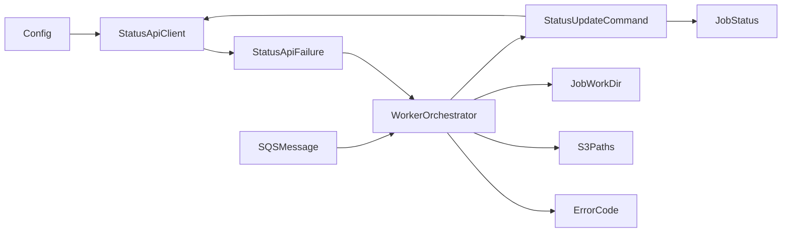

# Domain Entities - ai-worker Status API Target

## 1. Domain Boundary

The Worker domain owns one processing attempt for a validated SQS delivery. It owns typed outbound status commands but does not own a persisted Job record. Backend owns persistence behind the Status API.

## 2. Core Input Entity

### `SQSMessage`

```python
@dataclass(frozen=True)
class SQSMessage:
    job_id: str
    requirements_bucket: str
    requirements_key: str
    assets_prefix: str
    receipt_handle: str
    schema_version: str
```

Validation invariants:
- Body is a JSON object.
- `schemaVersion` is `1.0`.
- `jobId` is a non-empty UUID string.
- `requirements.bucket` and `requirements.key` are non-empty strings.
- `assetsPrefix` is a string and may be empty.
- A Status API command can be addressed only after these invariants produce a complete entity.

## 3. Status and Error Enums

### `JobStatus`

```python
class JobStatus(str, Enum):
    UPLOAD_PENDING = "UPLOAD_PENDING"
    QUEUED = "QUEUED"
    ANALYZING = "ANALYZING"
    GENERATING_CODE = "GENERATING_CODE"
    BUILDING = "BUILDING"
    SUCCESS = "SUCCESS"
    FAILED = "FAILED"
    CANCELED = "CANCELED"
```

The Worker emits only ANALYZING, GENERATING_CODE, BUILDING, SUCCESS, and FAILED. Other enum values remain shared vocabulary but are never queried by the Worker.

### `ErrorCode`

```python
class ErrorCode(str, Enum):
    REQUIREMENTS_READ_FAILED = "REQUIREMENTS_READ_FAILED"
    INVALID_REQUIREMENTS = "INVALID_REQUIREMENTS"
    AI_GENERATION_FAILED = "AI_GENERATION_FAILED"
    BUILD_FAILED = "BUILD_FAILED"
    ARTIFACT_UPLOAD_FAILED = "ARTIFACT_UPLOAD_FAILED"
    INTERNAL_ERROR = "INTERNAL_ERROR"
```

No free-form error code is valid.

## 4. Status Specification Value

Each emitted status has one authoritative functional specification.

```python
@dataclass(frozen=True)
class StatusSpec:
    status: JobStatus
    progress: int | None
    message: str
    criticality: Literal["BEST_EFFORT", "MANDATORY"]
```

| Status | Progress | Message | Criticality |
|---|---:|---|---|
| ANALYZING | 25 | `요구조건을 분석하고 있습니다.` | BEST_EFFORT |
| GENERATING_CODE | 50 | `Android 코드를 생성하고 있습니다.` | BEST_EFFORT |
| BUILDING | 75 | `APK를 빌드하고 있습니다.` | BEST_EFFORT |
| SUCCESS | 100 | `앱 생성이 완료되었습니다.` | MANDATORY |
| FAILED | None | Safe message selected by ErrorCode | BEST_EFFORT |

## 5. Outbound Status Command

### `StatusUpdateCommand`

```python
@dataclass(frozen=True)
class StatusUpdateCommand:
    job_id: str
    status: JobStatus
    message: str
    progress: int | None = None
    artifact_key: str | None = None
    error_code: ErrorCode | None = None
```

Functional invariants:
- `job_id` is the validated `SQSMessage.job_id`.
- `message` is the exact phase message or mapped safe error message.
- ANALYZING, GENERATING_CODE, and BUILDING carry progress only.
- SUCCESS carries progress and verified artifact key.
- FAILED carries error code and no progress/artifact key.
- Serialization always includes `status` and `message` and omits every `None` field.

JSON mapping:

| Domain field | JSON field | Serialization |
|---|---|---|
| `status` | `status` | Enum string value |
| `progress` | `progress` | Integer when present |
| `message` | `message` | Safe UTF-8 string |
| `artifact_key` | `artifactKey` | String when present |
| `error_code` | `errorCode` | Enum string value when present |

The command contains no API key, response body, SQS receipt handle, raw requirements, or credentials.

## 6. Status API Failure Value

### `StatusApiFailureKind`

```python
class StatusApiFailureKind(str, Enum):
    HTTP_4XX = "HTTP_4XX"
    HTTP_5XX = "HTTP_5XX"
    HTTP_OTHER = "HTTP_OTHER"
    CONNECTION = "CONNECTION"
    TIMEOUT = "TIMEOUT"
```

### `StatusApiFailure`

```python
class StatusApiFailure(WorkerError):
    error_code = ErrorCode.INTERNAL_ERROR

    kind: StatusApiFailureKind
    status_code: int | None
    attempt_count: int
```

Functional invariants:
- Represents only a final failed status command, after any permitted retry.
- `status_code` is absent for connection and timeout failures.
- `attempt_count` is 1 for non-retryable outcomes and 3 only after exhausted 5xx attempts, unless an earlier retried request finishes with a non-retryable outcome.
- Exception text and attributes exclude API key, request JSON, full response body, credentials, and signed URLs.
- When raised by mandatory SUCCESS, existing classification resolves to INTERNAL_ERROR.

## 7. Safe Failure Message Mapping

```python
ERROR_MESSAGES: dict[ErrorCode, str] = {
    ErrorCode.REQUIREMENTS_READ_FAILED: "요구조건 파일을 읽지 못했습니다.",
    ErrorCode.INVALID_REQUIREMENTS: "요구조건 형식이 올바르지 않습니다.",
    ErrorCode.AI_GENERATION_FAILED: "앱 코드 생성에 실패했습니다.",
    ErrorCode.BUILD_FAILED: "APK 빌드에 실패했습니다.",
    ErrorCode.ARTIFACT_UPLOAD_FAILED: "빌드 결과 업로드에 실패했습니다.",
    ErrorCode.INTERNAL_ERROR: "내부 오류가 발생했습니다.",
}
```

The mapping, not the raw exception text, supplies FAILED `message`.

## 8. Target Configuration Entity

```python
@dataclass(frozen=True)
class Config:
    aws_region: str
    sqs_queue_url: str
    s3_bucket_name: str
    prompton_api_base_url: str
    prompton_status_api_key: str | None
    work_dir: str
    visibility_timeout: int
    cleanup_hours: int
    log_level: str
    hermes_cli_path: str
    kiro_cli_path: str
    gradle_path: str
```

Configuration invariants:
- SQS URL, S3 bucket, and Status API base URL are required and non-empty.
- API base URL is normalized for endpoint joining without revealing secrets.
- Missing/empty/whitespace API key becomes `None`.
- `dynamodb_table_name` does not exist in the target entity.

## 9. Job Workspace Value

```python
@dataclass(frozen=True)
class JobWorkDir:
    base_path: Path
    requirements_path: Path
    refined_prompt_path: Path
    assets_dir: Path
    project_dir: Path
    output_dir: Path
    apk_path: Path
```

For Job ID `J` under configured root `R`:
- `base_path = R/J`
- `requirements_path = R/J/requirements.json`
- `refined_prompt_path = R/J/refined-prompt.md`
- `assets_dir = R/J/assets`
- `project_dir = R/J/project`
- `output_dir = R/J/output`
- `apk_path = R/J/output/app-debug.apk`

Every processing attempt recreates `base_path` before use.

## 10. S3 Path Value

```python
@dataclass(frozen=True)
class S3Paths:
    requirements_key: str
    assets_prefix: str
    source_key: str
    artifact_key: str
```

For Job ID `J`:
- requirements: `jobs/J/requirements/requirements.json`
- assets: `jobs/J/assets/`
- source: `jobs/J/source/project.zip`
- artifact: `jobs/J/artifact/app-debug.apk`

Only the artifact key returned by verified upload may populate SUCCESS.

## 11. Existing Worker Exception Family

```python
class WorkerError(Exception):
    error_code: ErrorCode
    user_message: str

class RequirementsReadError(WorkerError): ...
class InvalidRequirementsError(WorkerError): ...
class AIGenerationError(WorkerError): ...
class BuildError(WorkerError): ...
class ArtifactUploadError(WorkerError): ...
class StatusApiFailure(WorkerError): ...
```

`classify_error` returns the typed error code for `WorkerError` and INTERNAL_ERROR for any other exception. `user_message_for` returns only the safe mapped message.

## 12. Entity Relationships



### Text Alternative

```text
Config initializes StatusApiClient.
A validated SQSMessage enters WorkerOrchestrator.
WorkerOrchestrator creates StatusUpdateCommand, JobWorkDir, and S3Paths values.
StatusUpdateCommand uses JobStatus and optional ErrorCode.
StatusApiClient either completes normally or raises StatusApiFailure to the orchestrator.
No domain entity models a DynamoDB record or Backend GET result.
```

## 13. Removed Persistence Entity

The historical DynamoDB Job record is not a Worker domain entity in the target design. The Worker does not read or write `status`, `progress`, `message`, `errorCode`, `artifactKey`, or `logs` as database fields. It only emits the typed JSON command; Backend owns persistence semantics.
