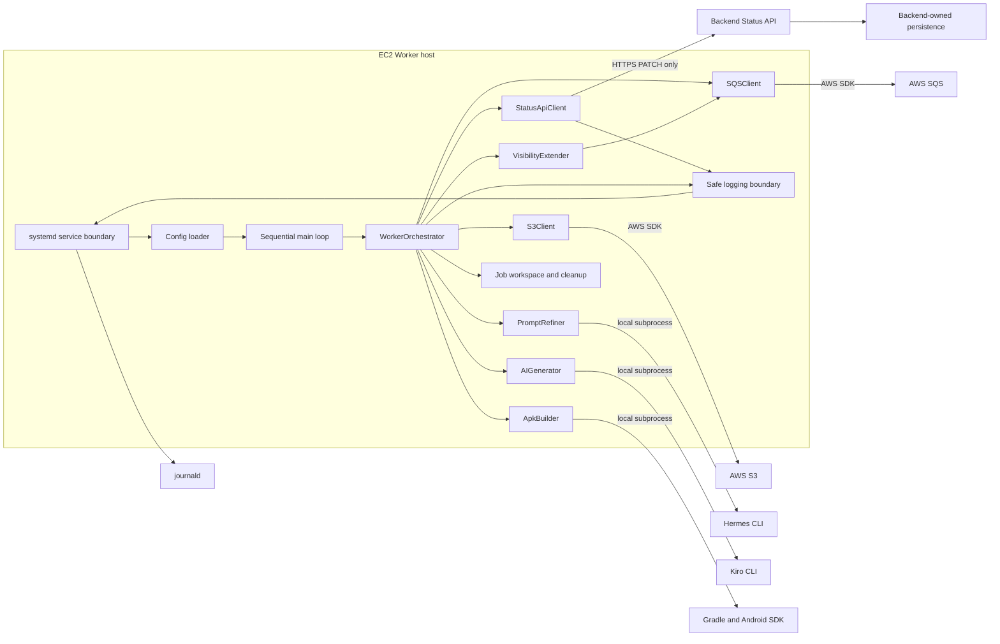
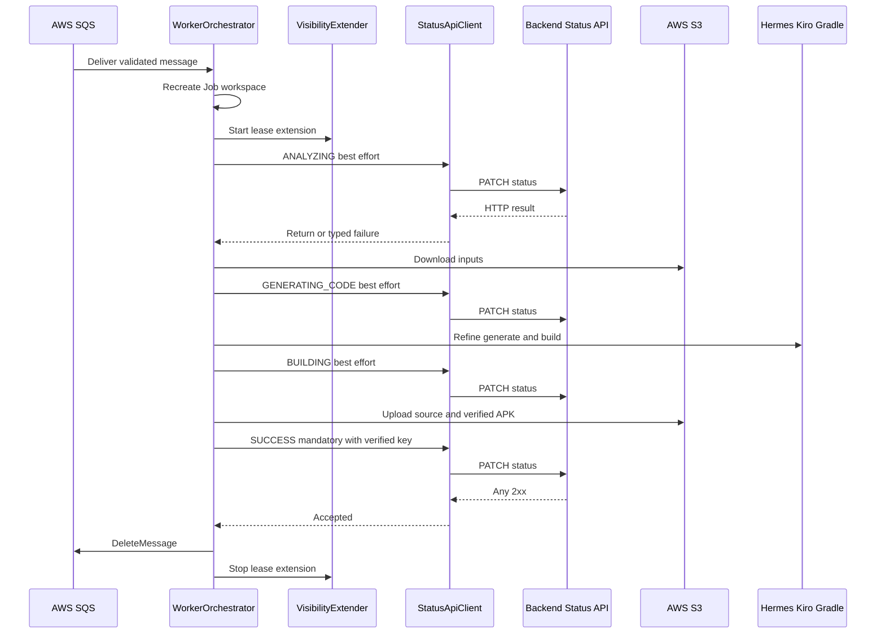

# Logical Components - ai-worker Status API Migration

## 1. Design Status and Boundary

- **Unit**: `ai-worker`
- **Runtime boundary**: One Python 3.12 process on EC2, supervised by systemd
- **Processing model**: One SQS Job at a time plus the existing per-Job visibility-extension daemon thread
- **Status boundary**: Outbound HTTPS PATCH through `StatusApiClient`; no Worker status GET
- **Persistence boundary**: S3 and SQS remain Worker data-plane dependencies; Backend owns status persistence and DynamoDB
- **Design purpose**: Allocate the approved NFR patterns to concrete logical components and test/operational seams

This stage does not add infrastructure, modify source, execute a live Job, or authorize production activation.

## 2. Logical Topology



### Text Alternative

```text
systemd loads protected configuration and starts one sequential Worker main loop.
The main loop delegates one message to WorkerOrchestrator.
WorkerOrchestrator coordinates StatusApiClient, SQSClient, S3Client,
PromptRefiner, AIGenerator, ApkBuilder, workspace cleanup, and the existing
VisibilityExtender thread. StatusApiClient sends HTTPS PATCH only to Backend.
SQSClient and S3Client use the AWS SDK. Local tool adapters use subprocesses.
Safe Python logs flow through stdout/stderr to journald. Backend alone owns
status persistence; no Worker component reaches DynamoDB or Backend GET.
```

### Mermaid Validation Record

- Node identifiers use alphanumeric characters and underscores only.
- Labels with spaces or punctuation are quoted.
- Every edge has valid source and target nodes.
- The diagram has the complete text alternative above.

## 3. Component Responsibility Matrix

| Component | Owns | Must not own | Primary NFR allocation |
|---|---|---|---|
| systemd service boundary | Process identity, environment injection, restart, stop ceiling, hardening, journald routing | Job policy, HTTP retry, application secrets in unit text | REL-007, SEC-005/006/008, OPS-002, MAINT-004 |
| Config loader | Required-value validation, optional-key normalization, immutable settings | Network calls, secret logging, DynamoDB table setting | SEC-004/005, OPS-001 |
| Sequential main loop | Cleanup-before-poll, one-message receive loop, shutdown gate | Concurrent Jobs, status GET, Job phase policy | PERF-002/003, SCALE-001 |
| `WorkerOrchestrator` | Phase order, status criticality, original-error preservation, completion barrier, delete policy | HTTP classification/backoff, status persistence | REL-001 through REL-006, OBS-001/002 |
| `StatusApiClient` | URL/header/payload, synchronous PATCH, timeout, 5xx-only retry, typed failure, safe HTTP events | Job criticality, SQS deletion, Backend GET, response-body interpretation | PERF-004/005/006, SEC-002/004/007, OBS-005 |
| `SQSClient` | Receive, delete, visibility, queue attributes | Job completion decision, DynamoDB access | PERF-003, REL-006/008 |
| `VisibilityExtender` | Per-Job lease extension thread and paired stop | Job failure escalation | REL-006 |
| `S3Client` | Inputs, source upload, artifact upload and HeadObject/size verification | SUCCESS or SQS delete authorization | REL-003, E2E-001/002 |
| AI/build adapters | Existing Hermes, Kiro, and Gradle execution | New Worker timeouts, status persistence | PERF-001, MAINT-001 |
| Workspace/cleanup | Clean per-attempt directory, owner-only mode where supported, age cleanup | Cross-Job shared mutable state | REL-001, SEC-006, OPS-004 |
| Safe logging boundary | Allowlisted event fields and levels | Raw objects, headers, bodies, secrets, arbitrary exception text | SEC-007, OBS-001 through OBS-005 |
| Validation harness | Deterministic fakes, call records, scans, static and deployment gates | Live network in unit tests | MAINT-001 through MAINT-005 |
| External acceptance observers | Backend GET and Mobile verification, E2E evidence contribution | Worker production code | REL-009, E2E-001 through E2E-003 |

## 4. systemd Service Boundary

### Responsibilities

- Run as the dedicated `prompton` user/group.
- Load `/etc/prompton-worker/env` without echoing its content.
- Execute `/opt/prompton-ai-worker/.venv/bin/python -m main`.
- Send stdout/stderr to journald with `SyslogIdentifier=prompton-worker`.
- Apply `Restart=on-failure`, `RestartSec=5`, SIGTERM, and `TimeoutStopSec=300`.
- Retain `NoNewPrivileges=true`, `ProtectSystem=strict`, `ProtectHome=true`, `PrivateTmp=true`, and explicit `ReadWritePaths`.
- Allow writes only to required Worker and tool paths, including `/data/jobs` and approved Hermes/Gradle/Android paths.

### Validation Interface

The component is represented by `deploy/prompton-worker.service` and validated through content assertions plus `systemd-analyze verify` on a compatible Linux host. No application class wraps systemd.

## 5. Configuration Component

### Target Value

```python
@dataclass(frozen=True)
class Config:
    aws_region: str
    sqs_queue_url: str
    s3_bucket_name: str
    prompton_api_base_url: str
    prompton_status_api_key: str | None = field(repr=False)
    work_dir: str
    visibility_timeout: int
    cleanup_hours: int
    log_level: str
    hermes_cli_path: str
    kiro_cli_path: str
    gradle_path: str
```

`field(repr=False)` is a defense-in-depth design so accidental configuration representation cannot disclose the optional key. Production code must still avoid logging the whole Config object.

### Load and Normalization Flow

1. Read and strip required `SQS_QUEUE_URL`, `S3_BUCKET_NAME`, and `PROMPTON_API_BASE_URL`.
2. Fail before logging setup completion or SQS polling when any required value is empty.
3. Remove trailing `/` characters from the non-empty API base URL for stable endpoint composition.
4. Read `PROMPTON_STATUS_API_KEY`; normalize missing, empty, or whitespace-only values to `None`.
5. Preserve existing validated numeric/tool/log settings.
6. Return one frozen Config value.

`DYNAMODB_TABLE_NAME` and a DynamoDB table field do not exist in the target configuration.

### Exposure Rules

- The base URL is non-secret and may appear in sanitized startup context.
- The key is consumed only by `StatusApiClient` header construction.
- Configuration errors identify the variable name, not a supplied value.
- The environment template has an empty placeholder and no real secret.

## 6. Sequential Main Loop

### Responsibilities

```text
while shutdown is not requested:
    remove expired Job workspaces; warn on cleanup failure
    receive at most one SQS message with zero-second short polling
    if no message: wait 0.5 seconds unless shutting down, then continue
    if envelope is invalid: log sanitized category and preserve it for redrive
    if message is valid: call process_job and wait for it to return
```

The main loop does not create worker pools, tasks, or async status reporting. The next receive cycle starts only after the current Job path has completed and stopped its visibility extender.

## 7. WorkerOrchestrator

### NFR Responsibilities

- Recreate the Job workspace for every validated delivery.
- Start and stop visibility extension exactly once.
- Apply best-effort criticality to ANALYZING, GENERATING_CODE, BUILDING, and FAILED.
- Apply mandatory criticality to SUCCESS.
- Preserve the exact status payload specifications owned by Functional Design.
- Keep artifact verification, accepted SUCCESS, and SQS deletion in strict order.
- Keep the original error classification when FAILED reporting also fails.
- Distinguish a post-accepted-SUCCESS DeleteMessage failure from a processing failure.
- Emit only allowlisted lifecycle events.

### Control Boundaries

```python
def _report_intermediate_status(job_id: str, status: JobStatus) -> None:
    """Catch only final StatusApiFailure, warn safely, and return."""


def _report_success(job_id: str, artifact_key: str) -> None:
    """Return only after accepted 2xx; do not absorb StatusApiFailure."""


def _report_failure(job_id: str, original_error: BaseException) -> None:
    """Capture original classification first; contain reporting failure."""
```

The post-SUCCESS delete call uses a narrow acknowledgment-error branch. It is not covered by the generic processing-failure handler that emits FAILED. This structural separation prevents contradictory terminal commands.

### Conceptual State

| Local state | Meaning | Permitted next action |
|---|---|---|
| `PROCESSING` | Inputs/AI/build/finalization are active | Continue or classify failure |
| `ARTIFACT_VERIFIED` | Required APK upload and size check passed | Send mandatory SUCCESS |
| `SUCCESS_ACCEPTED` | Status API returned a 2xx | Attempt DeleteMessage |
| `ACKNOWLEDGED` | DeleteMessage returned normally | Finish successful attempt |
| `FAILED_LOCAL` | Original processing or mandatory SUCCESS failure captured | Attempt FAILED best-effort; keep message |
| `ACK_FAILED` | SUCCESS accepted but delete raised | Warn; do not emit FAILED; leave redelivery to SQS |

These values describe control-flow invariants and need not be persisted or introduced as a runtime enum.

## 8. StatusApiClient

### Public Contract

```python
def update_job_status(
    job_id: str,
    status: JobStatus,
    progress: int | None = None,
    message: str | None = None,
    artifact_key: str | None = None,
    error_code: ErrorCode | None = None,
) -> None:
    ...
```

The method returns `None` for every 2xx and raises one final `StatusApiFailure` otherwise.

### Internal Logical Parts

#### 8.1 Endpoint Builder

```text
normalized base URL
+ "/v1/jobs/"
+ previously validated UUID Job ID
+ "/status"
```

It strips trailing base slashes only and exposes no GET operation.

#### 8.2 Header Builder

- Start with `Content-Type: application/json`.
- Add `x-api-key` only when Config provides a non-empty key.
- Return headers directly to the transport call; never log or interpolate them into errors.

#### 8.3 Payload Builder

- Serialize enum values to strings.
- Convert `artifact_key` to `artifactKey` and `error_code` to `errorCode`.
- Omit every field whose value is `None`.
- Do not log the resulting mapping.

#### 8.4 Synchronous Transport Loop

```text
attempt = 1
send PATCH with json, headers, and timeout=(3, 10)
if response is any 2xx: log safe acceptance and return
if response is 5xx and attempt < 3: log safe retry, sleep [1, 2], increment, repeat
if response is 5xx on attempt 3: raise sanitized HTTP_5XX failure
if response is 4xx: raise sanitized HTTP_4XX failure immediately
if response is other non-2xx/non-5xx: raise sanitized HTTP_OTHER failure immediately
if connection or timeout occurs: raise sanitized typed failure immediately
```

The production request uses requests default certificate verification. No `verify=False` argument or TLS-disable setting exists.

#### 8.5 Failure Mapper

```python
class StatusApiFailureKind(str, Enum):
    HTTP_4XX = "HTTP_4XX"
    HTTP_5XX = "HTTP_5XX"
    HTTP_OTHER = "HTTP_OTHER"
    CONNECTION = "CONNECTION"
    TIMEOUT = "TIMEOUT"
```

The exception holds only kind, optional status code, and actual attempt count. A mandatory SUCCESS failure maps to `INTERNAL_ERROR` when the orchestrator classifies the original exception.

### HTTP Event Interface

The client sends only safe scalar fields to Python logging:
- Job ID
- status enum
- attempt number
- response class or failure kind
- numeric status code when available
- selected retry delay

It never passes request headers, payload, response content, response text, or raw requests exception text to logging.

## 9. Successful Interaction



### Text Alternative

```text
A valid SQS delivery starts a clean workspace and visibility extension.
Intermediate PATCH commands are attempted but their final failure is contained.
After inputs, Hermes/Kiro, and Gradle, S3 uploads and verifies the APK.
Only then is SUCCESS sent as mandatory. Any 2xx authorizes DeleteMessage.
The visibility extender stops on completion.
```

### Mermaid Validation Record

- Participants use valid aliases.
- Messages use valid `->>` and `-->>` arrows.
- Message labels contain no unescaped quote delimiters.
- The complete text alternative follows the diagram.

## 10. Failure Interactions

### 10.1 Processing or Mandatory SUCCESS Failure

```text
original processing operation raises
-> capture original exception
-> map to approved errorCode and fixed safe message
-> call FAILED through the normal client policy, with no progress/artifact key
-> if FAILED also fails, log original errorCode plus safe reporting kind/attempt
-> stop visibility in finally
-> do not delete SQS message
```

### 10.2 Intermediate Reporting Failure

```text
StatusApiClient exhausts or immediately rejects an intermediate command
-> orchestrator logs sanitized WARNING
-> next local processing component runs
```

### 10.3 Accepted SUCCESS, Delete Failure

```text
artifact verified
-> SUCCESS returns accepted 2xx
-> DeleteMessage raises
-> log sanitized acknowledgment WARNING
-> do not send FAILED
-> stop visibility
-> leave message for SQS redelivery
```

### Failure Matrix

| Injected failure | Containing component | Continued work | FAILED attempted | Delete attempted |
|---|---|---|---|---|
| ANALYZING final failure | Orchestrator intermediate wrapper | Requirements onward | No | Later only if Job succeeds |
| GENERATING_CODE final failure | Orchestrator intermediate wrapper | Hermes/Kiro onward | No | Later only if Job succeeds |
| BUILDING final failure | Orchestrator intermediate wrapper | Gradle onward | No | Later only if Job succeeds |
| Requirements/AI/build/artifact | Orchestrator Job failure branch | No | Yes, best-effort | No |
| SUCCESS final failure | Orchestrator Job failure branch | No | Yes as INTERNAL_ERROR | No |
| FAILED final failure | Orchestrator reporting wrapper | Original failure retained | Already attempted | No |
| Visibility extension | VisibilityExtender | Current Job | No, unless Job separately fails | Based on final Job result |
| Source upload | Orchestrator best-effort source branch | Artifact finalization | No | Based on final Job result |
| Delete after accepted SUCCESS | Narrow acknowledgment branch | Attempt ends | No | Yes, once |

## 11. SQS and Visibility Components

### SQSClient

- Receive uses `WaitTimeSeconds=0` and `MaxNumberOfMessages=1`; empty responses wait 0.5 seconds in the orchestrator.
- Public operations remain receive, delete, visibility change, and queue attributes.
- boto3 uses the EC2 Instance Profile and scoped SQS permissions.
- The client never decides that a Job is complete.

### VisibilityExtender

- One daemon thread exists only during one active Job.
- It waits for the configured fraction of effective visibility and calls the SQS adapter.
- It catches extension errors, logs a safe warning, and continues waiting until stopped.
- `stop` is idempotent at the orchestrator boundary and is called from `finally`.

No additional Job-processing thread or HTTP thread is introduced.

## 12. S3, Workspace, AI, and Build Components

### S3Client

- Requirements and assets retain existing input behavior.
- Source upload remains best-effort.
- Artifact upload returns its key only after HeadObject and local/remote size comparison succeed.
- S3 errors map to approved requirements-read or artifact-upload errors at the existing boundary.

### Workspace and Cleanup

- Base path is configured `WORK_DIR`, default `/data/jobs`.
- Every valid delivery deletes and recreates `{WORK_DIR}/{jobId}`.
- Apply mode 0700 where supported.
- Cleanup removes directories older than configured retention, default 24 hours, before receive; errors are warning-only.

### PromptRefiner, AIGenerator, and ApkBuilder

- Interfaces remain synchronous.
- Hermes retains its existing bounded attempts and raw-input fallback.
- Kiro and Gradle retain no Worker timeout.
- Subprocess stdout/stderr that may contain sensitive content is not logged raw.
- Their completion/failure feeds the orchestrator's approved classification, not Status API transport logic.

## 13. Safe Logging Component

### Event Construction API

The logical API accepts a fixed event name and explicit safe scalars rather than an arbitrary object:

```python
logger.info(
    "status_update_accepted job_id=%s status=%s attempt=%d result_class=%s",
    job_id,
    status.value,
    attempt,
    result_class,
)
```

Equivalent stable key/value text is sufficient; a JSON logging dependency is not added.

### Level Allocation

- INFO: Job/phase start and completion, status acceptance, artifact verification, final success.
- WARNING: 5xx retry, intermediate report failure, Hermes fallback, visibility/source warning, delete acknowledgment failure.
- ERROR: final Job failure and FAILED-reporting failure.
- DEBUG: allowlisted non-sensitive diagnostics only.

### Prohibited Inputs

- Config object or API key
- headers or status payload
- raw Client JSON
- Hermes stdout/stderr
- AWS credentials or session token
- signed URL
- Backend response body
- raw exception text from an external library

Caplog tests use sentinel values for every prohibited category and assert zero occurrences across all levels.

## 14. Validation Harness Components

### Fake HTTP Session

Records URL, JSON mapping, headers, and timeout in memory for assertions, but test failures and snapshots must redact the sentinel key. It returns configured response objects or raises configured requests exceptions.

### Sleep Recorder

Records delay values without sleeping. Expected sequences are exactly `[]`, `[1]`, or `[1, 2]` depending on response order.

### Shared Call Recorder

S3, Status API, SQS, AI, build, and visibility fakes append symbolic operations. Assertions prove:
- complete repeated processing
- intermediate continuation
- verified artifact before SUCCESS
- accepted SUCCESS before delete
- no delete on failure
- no FAILED after accepted SUCCESS/delete failure
- visibility start/stop pairing

### Static and Deployment Validators

- Source/import scan: no runtime DynamoDB, status GET, terminal precheck, append-log, or stale table variable.
- Dependency scan: exact requests pin and SQS/S3-only AWS test extras.
- Secret/TLS scan: no real key, `verify=False`, warning suppression, or key-bearing diagnostics.
- Service/env checks: hardening, process values, writable paths, required values, and no real secret.
- Quality gates: pytest, Ruff, strict mypy, compileall, uv lock/frozen sync, and compatible-host systemd verification.

## 15. External Components and Acceptance Ownership

| External component | Worker production interaction | Acceptance contribution | Owner |
|---|---|---|---|
| Backend Status API | HTTPS PATCH only | HTTP acceptance, repeat-state and duplicate-SUCCESS behavior | Backend team |
| Backend GET API | None | External observation of stored states | Backend team/harness |
| Backend persistence | None | Safe repeated command persistence | Backend team |
| Mobile App | None | Final status and artifact observation | Mobile team |
| SQS/DLQ | AWS SDK through SQSClient | Redrive attributes and deletion evidence | Worker deployment/operator |
| S3 | AWS SDK through S3Client | Key, ContentLength, and APK hash evidence | Worker deployment/operator |
| Hermes/Kiro/Gradle | Local subprocess | Tool versions and successful pipeline evidence | Worker deployment/operator |

A live test requires an approved Job ID, environment, test window, and participants. The Worker source must not add GET merely to collect acceptance evidence.

## 16. Configuration and Dependency Flow

| Value/dependency | Source | Consumer | Protection/validation |
|---|---|---|---|
| SQS queue URL | protected environment | SQSClient | Required non-empty; non-secret operational value |
| S3 bucket name | protected environment | S3Client | Required non-empty; scoped IAM |
| Status API base URL | protected environment | StatusApiClient | Required, normalized, safe endpoint identity |
| Optional status API key | protected environment | StatusApiClient header builder only | `repr=False`, absent when blank, never logged |
| AWS credentials | EC2 Instance Profile | boto3 | No static environment keys |
| Work/tool paths | environment/defaults | workspace, AI, build | validation plus systemd `ReadWritePaths` |
| requests 2.34.2 | exact manifest/lock | StatusApiClient | lock check and frozen sync |
| boto3 1.35.99 | exact manifest/lock | SQSClient and S3Client | no DynamoDB runtime use |
| jsonschema 4.25.1 | exact manifest/lock | retained reference/runtime paths | separate cleanup required to remove |

## 17. Requirement and Story Allocation

| Source | Logical allocation |
|---|---|
| FR-SA-001, FR-SA-002, FR-SA-003 | Config and StatusApiClient endpoint/header/public contract |
| FR-SA-004, FR-SA-005, FR-SA-006 | Orchestrator intermediate wrappers and safe events |
| FR-SA-007 | S3 verification, mandatory SUCCESS, and SQS completion barrier |
| FR-SA-008 | Original-error preservation and FAILED wrapper |
| FR-SA-009, FR-SA-010, FR-SA-011, FR-SA-012 | StatusApiClient transport loop plus orchestrator criticality |
| FR-SA-013, FR-SA-014 | Sequential main/orchestrator clean full reprocessing with no GET |
| FR-SA-015, FR-SA-016 | Safe logging boundary and journald-only persistence |
| FR-SA-017, FR-SA-018 | Config and reproducible dependency components |
| NFR-SA-001, NFR-SA-002, NFR-SA-003 | IAM boundary, TLS, TCP 443 readiness, and key/environment protection |
| TR-SA-001, TR-SA-002 | Fake session/sleep and shared call recorder |
| TR-SA-003 | Static, quality, dependency, and deployment validators |
| TR-SA-004 | External acceptance observers and evidence bundle |
| US-SA-01 | Config, dependency, IAM, and deployment boundaries |
| US-SA-02 | Intermediate status collaboration |
| US-SA-03 | Artifact/SUCCESS/delete barrier |
| US-SA-04 | Original-error and FAILED collaboration |
| US-SA-05 | Synchronous bounded HTTP component |
| US-SA-06 | Key confinement, TLS, and safe journald events |
| US-SA-07 | Validation harness and external acceptance observers |

## 18. Component Invariants

1. No Worker component exposes a status GET operation or a DynamoDB dependency.
2. `StatusApiClient` never decides whether Job processing continues or whether SQS is deleted.
3. `WorkerOrchestrator` never reimplements HTTP status classification or backoff.
4. S3 verification returns before SUCCESS can receive an artifact key.
5. Only accepted SUCCESS unlocks DeleteMessage.
6. Delete failure after accepted SUCCESS cannot enter FAILED reporting.
7. FAILED reporting cannot replace the original error or authorize deletion.
8. Every active visibility extender is stopped on every orchestrator exit path.
9. The optional API key can flow only from protected configuration to the HTTP header builder.
10. Logs and evidence are built from safe scalar allowlists and never from payloads, bodies, headers, or arbitrary exceptions.
11. One process handles one Job; no new concurrency or autoscaling component exists.
12. Backend GET and Mobile observation remain external acceptance paths, never Worker production dependencies.

## 19. Deferred Work

Code Generation must implement these component changes and deterministic tests under a separately approved checkbox plan. Build and Test must run the local gates and produce readiness/evidence instructions. Actual AWS/API/S3 mutation, model consumption, external Backend/Mobile acceptance, deployment, and production activation require their own explicit approvals and available external systems.
