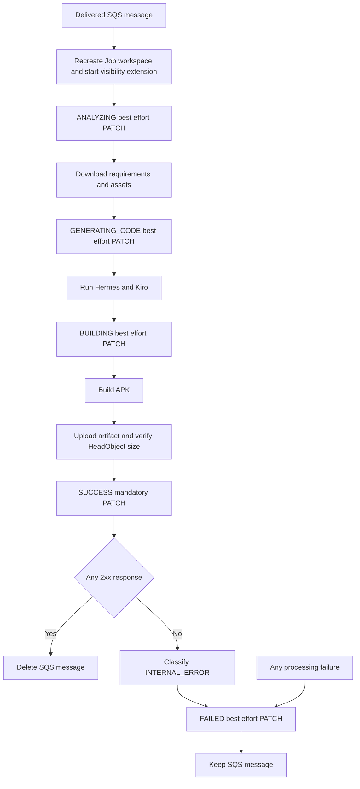

# Application Design - Prompton AI Worker Status API Migration

## 1. Design Scope and Status

- **Project type**: Brownfield
- **Deployable unit**: One sequential EC2 `ai-worker` process
- **Architecture style**: Modular by feature with a single orchestrator service
- **Change type**: Replace direct DynamoDB status persistence with an outbound Backend Status API adapter
- **Authoritative contract**: `status-api-requirements.md`
- **Application Design status**: Generated for explicit review; no application code changed in this stage

This design defines component boundaries and interactions. Functional Design will specify lifecycle rules in detail, and NFR Design will specify the concrete HTTP retry, timeout, security, and logging implementation patterns.

## 2. Target Project Boundary

| Target path | Role |
|---|---|
| `main.py` | Entrypoint and safe startup logging |
| `worker/orchestrator.py` | Job lifecycle orchestration |
| `worker/visibility_extender.py` | SQS lease extension |
| `status_api/client.py` | Backend Status API PATCH adapter |
| `sqs/client.py` | SQS data-plane adapter |
| `s3/client.py` | S3 input and output adapter |
| `ai/refiner.py` | Hermes prompt refinement |
| `ai/generator.py` | Kiro Android code generation |
| `build/builder.py` | Gradle APK build |
| `config/settings.py` | Environment loading and validation |
| `models/entities.py` | Configuration and Job entities |
| `models/enums.py` | Job statuses and error codes |
| `models/exceptions.py` | Typed errors and safe classification |

The new `status_api/` package includes its package initializer and client. The current `dynamo/` package has no target runtime responsibility and is removed during Code Generation. Backend API Gateway and Lambda own DynamoDB access outside this repository.

## 3. Core Architecture Decisions

| Decision | Target design | Rationale |
|---|---|---|
| Status adapter | Dedicated `StatusApiClient` | Keeps HTTP mechanics separate from AI, build, S3, SQS, and lifecycle policy. |
| Worker read behavior | No Job status GET | Approved policy requires full processing for every delivered message. |
| Intermediate reporting | Orchestrator catches typed client failure | ANALYZING, GENERATING_CODE, and BUILDING are best-effort. |
| Completion reporting | Typed failure propagates from SUCCESS | SUCCESS is mandatory and gates message deletion. |
| Failure reporting | Best-effort with original error preservation | A second Status API failure must not mask the Job failure. |
| HTTP result contract | `None` on any 2xx; typed sanitized exception otherwise | Body-independent success and testable failure semantics. |
| Authentication | Optional `x-api-key` built inside client | Encapsulates current no-auth and future key deployment. |
| Logs | Python logging to journald only | DynamoDB `logs` persistence and Backend log APIs are out of scope. |
| Dependency injection | Constructor-injected clients, HTTP session, and sleep seam | Deterministic tests without a DI framework. |
| Deployment unit | One Worker unit | No independent service/version boundary is introduced. |

## 4. Component Overview

| Component | Primary responsibility | Migration impact |
|---|---|---|
| `WorkerOrchestrator` | Own Job lifecycle and criticality | Replace Dynamo client, remove skip, enforce SUCCESS-before-delete. |
| `StatusApiClient` | Own PATCH transport contract | New component. |
| Config | Validate runtime settings | API URL/key replace table name. |
| `SQSClient` | Queue data plane | Public API unchanged. |
| `S3Client` | Input and verified artifact data plane | Public API unchanged; SUCCESS language updated. |
| `PromptRefiner` | Hermes refinement/fallback | Interface unchanged; local logs only. |
| `AIGenerator` | Kiro generation | Interface unchanged. |
| `ApkBuilder` | Gradle APK build | Interface unchanged. |
| `VisibilityExtender` | Preserve SQS lease | Interface unchanged; runs for every delivered Job. |
| Shared models/exceptions | Statuses, error codes, safe messages | Add typed Status API failure mapped to INTERNAL_ERROR. |

Detailed responsibilities and signatures are defined in `components.md` and `component-methods.md`.

## 5. End-to-End Component Flow



### Text Alternative

```text
Each SQS delivery starts from a clean Job workspace.
Intermediate statuses are attempted but cannot stop AI or build processing.
After build, S3 artifact upload plus HeadObject/size verification must succeed.
SUCCESS is then mandatory. Any 2xx permits SQS deletion.
SUCCESS failure becomes INTERNAL_ERROR, attempts FAILED best-effort, and keeps SQS.
Any other processing failure also attempts FAILED best-effort and keeps SQS.
```

The exact collaboration diagram and external dependencies are in `services.md` and `component-dependency.md`.

## 6. Status API Interface Contract

```python
update_job_status(
    job_id,
    status,
    progress=None,
    message=None,
    artifact_key=None,
    error_code=None,
)
```

The client owns:
- URL joining and fixed PATCH path.
- JSON field-name conversion and omission of `None`.
- Base content type and optional API key header.
- Connect/read timeout and 5xx-only retry policy.
- Any-2xx success classification without body parsing.
- Sanitized status/attempt/result logging.

The orchestrator owns:
- Which status is sent at each phase.
- Whether a final client failure is best-effort or mandatory.
- Artifact verification and SQS deletion order.
- Original error classification and FAILED reporting.

No public or private GET operation is designed for the Worker.

## 7. Lifecycle Invariants

1. Every delivered valid SQS message is processed from the beginning.
2. Existing Job workspace content is removed before processing.
3. ANALYZING, GENERATING_CODE, and BUILDING reporting cannot terminate the processing phase.
4. APK upload and HeadObject/size verification precede SUCCESS.
5. `SQSClient.delete_message` is unreachable until SUCCESS returns normally after any 2xx.
6. SUCCESS final failure is classified as `INTERNAL_ERROR` and does not delete the message.
7. FAILED omits progress, is best-effort, and cannot replace the original Job error.
8. Visibility extension stops on every path.
9. No component directly accesses DynamoDB or reads Job status from Backend.

Functional Design will turn these invariants into detailed business rules and failure paths.

## 8. Configuration and Dependency Design

### Required Environment

- `SQS_QUEUE_URL`
- `S3_BUCKET_NAME`
- `PROMPTON_API_BASE_URL`

### Optional Environment

- `PROMPTON_STATUS_API_KEY`
- Existing AWS region, work directory, visibility, cleanup, logging, and tool-path values

`DYNAMODB_TABLE_NAME` is removed. Startup logs may show the normalized API base URL but never the API key.

### Runtime Dependencies

- Add exact `requests==2.34.2` for Status API HTTPS calls.
- Retain boto3 for SQS and S3.
- Remove DynamoDB-specific moto and boto3 stub extras if the final source/test scan finds no remaining use.
- Use requests default certificate verification; TLS certificate checks remain enabled.

## 9. Error and Observability Boundaries

A typed Status API exception carries only sanitized failure metadata needed for orchestration and logs. Existing exception classification maps mandatory SUCCESS failure to `INTERNAL_ERROR`.

Operational events go through Python logging and journald:
- Status PATCH result, class, attempts, and retry decisions.
- Phase start and completion.
- Final success or approved errorCode.
- Failure-reporting problems that preserve the original classification.

The design prohibits API keys, raw Client JSON, Hermes stdout/stderr, signed URLs, AWS credentials, and full Backend response bodies in logs or exception messages.

## 10. Removed Design Elements

- Worker-side DynamoDB resource and table name.
- `get_job_status`, terminal-state skip, and early-delete path.
- Direct status `UpdateItem` and DynamoDB log append.
- DynamoDB IAM permissions for the Worker.
- DynamoDB-specific startup/deployment configuration.
- Assumption that user-facing phase logs are persisted by the Worker.

Historical documents outside this Application Design directory may describe the old baseline; the approved Status API requirements and this target design supersede those clauses for the active migration.

## 11. Requirement Traceability

| Design area | Requirement coverage |
|---|---|
| Client boundary and endpoint | FR-SA-001, FR-SA-003 |
| Optional authentication | FR-SA-002 |
| Intermediate payloads and criticality | FR-SA-004, FR-SA-005, FR-SA-006, FR-SA-012 |
| Verified completion and deletion | FR-SA-007 |
| Failure reporting | FR-SA-008 |
| HTTP response, retry, timeout | FR-SA-009, FR-SA-010, FR-SA-011 |
| No GET and full reprocessing | FR-SA-013, FR-SA-014 |
| Local-only operational logs | FR-SA-015, FR-SA-016 |
| Configuration and dependencies | FR-SA-017, FR-SA-018 |
| IAM, TLS/egress, secret boundary | NFR-SA-001, NFR-SA-002, NFR-SA-003 |
| Test seams and joint E2E boundary | TR-SA-001, TR-SA-002, TR-SA-003, TR-SA-004 |

## 12. Deferred Design Work

- **Functional Design**: Exact state payload mapping, failure matrix, exception preservation, call ordering, and no-GET reprocessing rules.
- **NFR Requirements**: Measurable HTTP, TLS, credential, logging, dependency, and operational constraints.
- **NFR Design**: Concrete retry/sanitization/degradation patterns and validation mechanisms.
- **Code Generation**: Source, tests, dependency lock, deployment files, and obsolete DynamoDB package removal.
- **Build and Test**: Full local gates and approved joint Backend GET/Mobile E2E readiness and evidence.
