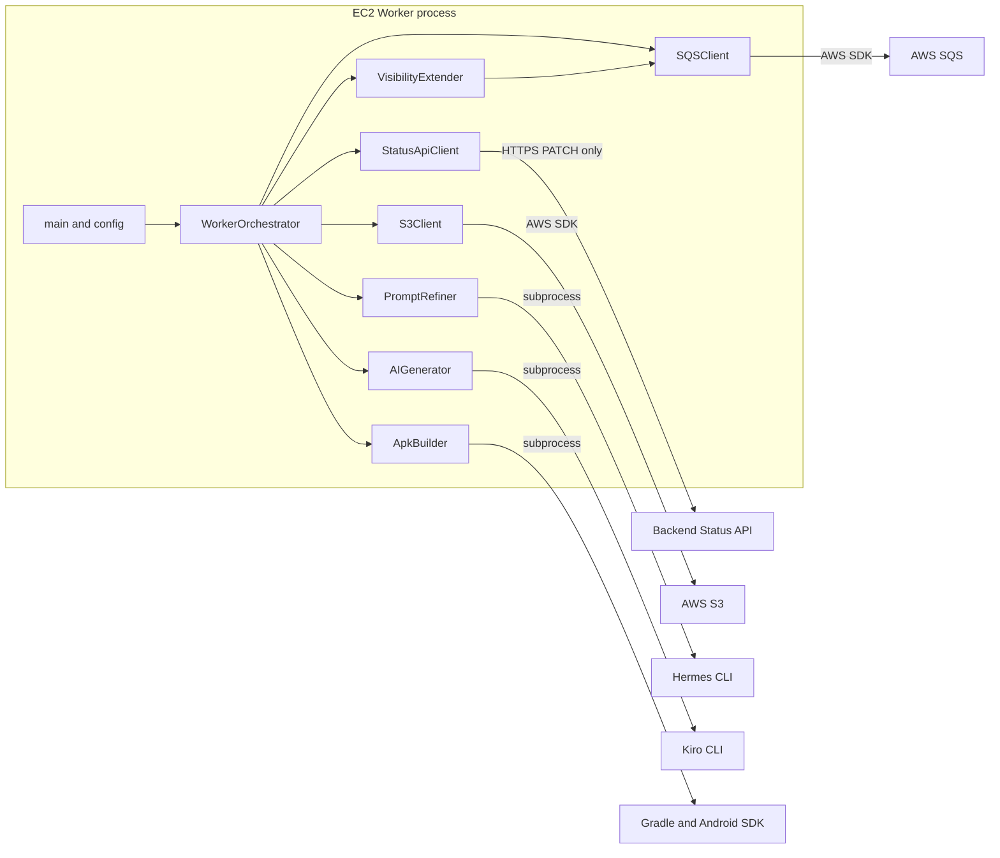

# Component Dependencies - Prompton AI Worker Status API Target Design

## Dependency Principles

- `WorkerOrchestrator` may depend on feature interfaces; feature clients do not depend on the orchestrator.
- `StatusApiClient` depends only on configuration, shared enums/exceptions, requests, and logging.
- SQS/S3 clients remain AWS SDK adapters and have no Status API dependency.
- No Worker component depends on DynamoDB, a Backend GET client, or a Backend log API.
- Constructor injection provides test seams without introducing a dependency-injection framework.

## Dependency Matrix

| Source component | Direct dependencies | Communication | Change |
|---|---|---|---|
| `main` | config, logging, `WorkerOrchestrator` | In-process construction | Remove table logging; show only non-secret API base configuration. |
| `WorkerOrchestrator` | SQS, S3, Status API, refiner, AI generator, builder, visibility, shared models | Synchronous method calls | Replace Dynamo client and remove terminal precheck. |
| `StatusApiClient` | Config, `JobStatus`, `ErrorCode`, Status API exception, requests, logging | HTTPS PATCH | New dependency boundary. |
| `SQSClient` | Config, boto3, `SQSMessage` | AWS SDK HTTPS | Existing. |
| `S3Client` | Config, boto3, filesystem, Worker exceptions | AWS SDK HTTPS | Existing; documentation points to Status API SUCCESS. |
| `PromptRefiner` | Filesystem, Hermes subprocess, logging | Local subprocess | Existing. |
| `AIGenerator` | Config, filesystem, Kiro subprocess, logging | Local subprocess | Existing. |
| `ApkBuilder` | Config, filesystem, Gradle subprocess, logging | Local subprocess | Existing. |
| `VisibilityExtender` | `SQSClient`, threading, logging | In-process thread | Existing. |
| Config | environment and `Config` model | Read-only startup values | API URL/key replace table name. |

## Component Diagram



### Text Alternative

```text
main/config constructs WorkerOrchestrator.
WorkerOrchestrator calls StatusApiClient, SQSClient, S3Client, PromptRefiner,
AIGenerator, ApkBuilder, and VisibilityExtender.
StatusApiClient sends HTTPS PATCH only to Backend Status API.
SQSClient and S3Client use the AWS SDK; local tool adapters use subprocesses.
No Worker path reaches DynamoDB or Backend GET.
```

## External Dependencies

| External system | Adapter | Protocol | Authentication | Worker operation |
|---|---|---|---|---|
| Backend Status API | `StatusApiClient` | HTTPS | None currently; optional `x-api-key` | PATCH only |
| Backend GET API | None | None from Worker | None | Joint E2E observer only |
| AWS SQS | `SQSClient` | HTTPS through boto3 | EC2 IAM role | Receive, delete, visibility, attributes |
| AWS S3 | `S3Client` | HTTPS through boto3 | EC2 IAM role | Get/list input, put/head output |
| DynamoDB | None | None from Worker | None | Backend-owned and unreachable from Worker code |
| Hermes | `PromptRefiner` | Local subprocess | Host configuration | Refine prompt |
| Kiro | `AIGenerator` | Local subprocess | Host configuration | Generate Android project |
| Gradle/Android SDK | `ApkBuilder` | Local subprocess | N/A | Build APK |

## Configuration Dependency Flow

| Config field | Consumers | Exposure rule |
|---|---|---|
| `sqs_queue_url` | `SQSClient` | Non-secret operational value |
| `s3_bucket_name` | `S3Client` | Non-secret operational value |
| `prompton_api_base_url` | `StatusApiClient`, safe startup log | Non-secret; normalized without trailing slash |
| `prompton_status_api_key` | `StatusApiClient` only | Secret; never logged or included in exceptions |
| Existing tool/work fields | Worker, AI, build | Existing behavior |

`DYNAMODB_TABLE_NAME` and `Config.dynamodb_table_name` have no target consumer and are removed.

## Primary Data Flow

1. `SQSClient` returns a validated message to `WorkerOrchestrator`.
2. The orchestrator recreates local state and begins visibility extension.
3. `StatusApiClient` receives best-effort intermediate status commands.
4. S3, Hermes, Kiro, and Gradle components perform the existing processing flow.
5. `S3Client` returns an artifact key only after upload verification.
6. `StatusApiClient` receives mandatory SUCCESS with that artifact key.
7. Normal return from mandatory SUCCESS unlocks `SQSClient.delete_message`.

## Failure Data Flow

1. A processing adapter or mandatory SUCCESS raises an exception.
2. The orchestrator classifies the original exception.
3. It asks `StatusApiClient` to report FAILED without progress.
4. A second reporting exception is contained at the orchestrator boundary.
5. Visibility extension stops and the SQS message remains for queue-managed redelivery.

## Dependency Constraints for Tests

- Status client tests inject an HTTP session and sleep recorder.
- Orchestrator tests inject a status fake that records calls or raises typed failures.
- S3/SQS fakes record artifact verification and deletion ordering.
- No test requires moto DynamoDB or DynamoDB boto3 stubs after migration.
- Contract and E2E harnesses may call Backend GET externally, but Worker production code and Worker fakes do not expose GET.
