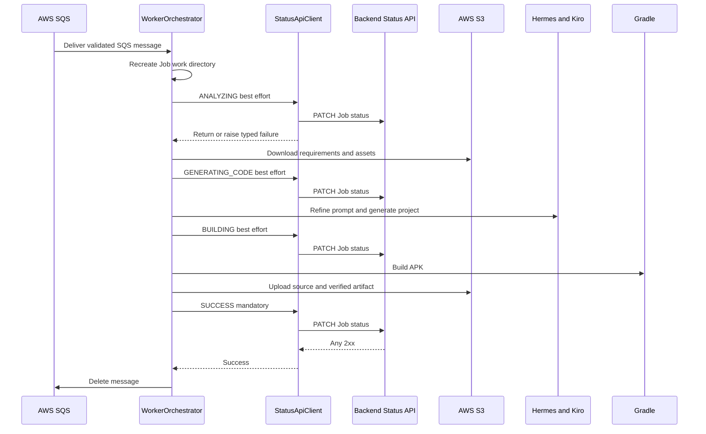

# Services - Prompton AI Worker Status API Target Design

## Service Architecture

The application remains one sequential Worker process. `WorkerOrchestrator` is the service layer; feature clients are in-process adapters. The migration changes only the status boundary and lifecycle decisions, not the single-process deployment model.

## 1. Worker Orchestrator Service

### Service Boundary

- **Input**: A validated `SQSMessage` containing Job ID and S3 input locations.
- **Primary outputs**: Generated source and verified APK in S3, PATCH status requests, and conditional SQS deletion.
- **Failure output**: Best-effort FAILED request plus sanitized journald event; the SQS message remains.
- **Forbidden behavior**: Job status GET, direct DynamoDB access, persistent Worker log writes, or deletion before SUCCESS 2xx.

### Successful Interaction



### Text Alternative

```text
SQS delivery
-> recreate workspace and start visibility extension
-> best-effort ANALYZING PATCH
-> download requirements and assets
-> best-effort GENERATING_CODE PATCH
-> Hermes refinement and Kiro generation
-> best-effort BUILDING PATCH
-> Gradle APK build
-> source upload and required artifact upload verification
-> mandatory SUCCESS PATCH
-> after any 2xx only, delete the SQS message
```

Every repeated SQS delivery starts this sequence again. There is no preflight status lookup.

## 2. Status Reporting Service

`StatusApiClient` is a transport adapter, not an independent deployable service.

### Responsibilities

- Convert typed method input into the approved JSON field names.
- Build the fixed PATCH endpoint and optional authentication header.
- Apply timeout, 2xx classification, and 5xx-only retry rules.
- Return normally on any 2xx and raise one sanitized typed failure otherwise.
- Provide enough non-sensitive context for operational logs: status, response class, attempt count, and failure category.

### Criticality Matrix

| Status | Orchestrator treatment of final client failure | Job processing | SQS deletion |
|---|---|---|---|
| ANALYZING | Catch and warn | Continue | Not applicable |
| GENERATING_CODE | Catch and warn | Continue | Not applicable |
| BUILDING | Catch and warn | Continue | Not applicable |
| SUCCESS | Do not absorb | Fail completion as `INTERNAL_ERROR` | Prohibited |
| FAILED | Catch and error-log | Preserve original failure | Prohibited |

The client does not select criticality. This prevents HTTP transport code from owning Job lifecycle rules.

## 3. Artifact Finalization Service Flow

The finalization collaboration is an ordered service transaction without a distributed rollback:

1. `S3Client.upload_source` runs with its existing best-effort semantics.
2. `S3Client.upload_artifact` uploads the APK.
3. `S3Client.upload_artifact` verifies HeadObject and object size.
4. `WorkerOrchestrator._report_success` calls `StatusApiClient` with the returned artifact key.
5. Only normal return from that call authorizes `SQSClient.delete_message`.

An artifact error prevents SUCCESS. A SUCCESS API error leaves the artifact and SQS message in place and enters failure handling.

## 4. Failure Reporting Service Flow

For a non-recoverable processing exception:

1. Capture the original exception.
2. Derive one of the six approved `ErrorCode` values and a predefined safe Korean message.
3. Call Status API with FAILED, message, and errorCode; do not pass progress.
4. If FAILED reporting also fails, log only sanitized metadata.
5. Preserve the original classification and keep the SQS message.

For mandatory SUCCESS failure, step 2 resolves to `INTERNAL_ERROR`, then follows the same best-effort FAILED path.

## 5. Visibility Extension Service

The existing daemon-thread collaboration remains:

- Start after workspace preparation and before long-running phases.
- Extend at the existing interval through `SQSClient`.
- Log extension failure and continue processing.
- Stop in `finally` on both success and failure.

Because terminal prechecks are removed, this service starts for every valid delivered Job.

## 6. Configuration and Startup Service

At startup:

1. `load_config` validates SQS URL, S3 bucket, and Status API base URL.
2. It normalizes the optional status API key without logging it.
3. `main` configures Python logging and reports non-secret service configuration.
4. `WorkerOrchestrator` constructs or receives all clients.

The startup service does not create a DynamoDB resource and does not log a table name or API key.

## 7. Observability Service Boundary

Python logging to stdout/stderr is collected by journald.

Required high-level events:
- Job and phase start/completion.
- PATCH status, success/failure class, attempt count, and 5xx retry.
- Final Job success or approved errorCode.
- FAILED-reporting failure without replacing the original error.

Prohibited content:
- API key or authentication headers.
- Raw Client JSON.
- Hermes stdout/stderr.
- AWS credentials or signed URLs.
- Full Backend response body or arbitrary exception payload.

No Backend log API or DynamoDB `logs` persistence is part of this service design.
