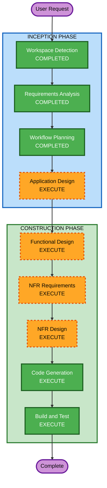

# Execution Plan

## Detailed Analysis Summary

### Change Impact Assessment
- **User-facing changes**: Yes - 모바일 앱에서 Job 진행 상태를 실시간 확인
- **Structural changes**: Yes - 전체 AI Worker 서비스 신규 생성
- **Data model changes**: Yes - DynamoDB Job 상태 레코드 관리
- **API changes**: No - Worker는 기존 Backend API와 직접 통신하지 않음 (DynamoDB 통해 간접 연동)
- **NFR impact**: Yes - 멱등성, 장애 복구, IAM 최소 권한, 순차 처리

### Risk Assessment
- **Risk Level**: Medium
  - SQS/S3/DynamoDB 연동은 표준적인 AWS 패턴
  - kiro-cli + Opus5 AI 코드 생성은 외부 도구 의존성
  - APK 빌드는 Gradle 환경 의존성
- **Rollback Complexity**: Easy (새 서비스이므로 기존 시스템 영향 없음)
- **Testing Complexity**: Moderate (AWS 서비스 모킹 필요, 실제 빌드 검증 필요)

---

## Workflow Visualization



### Text Alternative
```
INCEPTION PHASE:
  [x] Workspace Detection (COMPLETED)
  [x] Requirements Analysis (COMPLETED)
  [x] Workflow Planning (COMPLETED)
  [ ] Application Design (EXECUTE)

CONSTRUCTION PHASE:
  [ ] Functional Design (EXECUTE)
  [ ] NFR Requirements (EXECUTE)
  [ ] NFR Design (EXECUTE)
  [ ] Code Generation (EXECUTE)
  [ ] Build and Test (EXECUTE)
```

---

## Phases to Execute

### INCEPTION PHASE
- [x] Workspace Detection (COMPLETED)
- [x] Requirements Analysis (COMPLETED)
- [x] Workflow Planning (IN PROGRESS)
- [ ] Application Design - **EXECUTE**
  - **Rationale**: 새로운 AI Worker 서비스의 컴포넌트 구조, 모듈 설계, 외부 의존성 정의가 필요함
- [ ] User Stories - **SKIP**
  - **Rationale**: AI Worker는 사용자 직접 상호작용 없음. Backend와 DynamoDB를 통한 간접 연동이며, 요구사항이 기술적 연동 규격으로 이미 명확함
- [ ] Units Generation - **SKIP**
  - **Rationale**: 단일 서비스 (AI Worker 1개)이며 분해 불필요

### CONSTRUCTION PHASE
- [ ] Functional Design - **EXECUTE**
  - **Rationale**: 상태 전이 로직, 에러 처리, 중복 방지, Visibility Timeout 연장 등 복잡한 비즈니스 로직 상세 설계 필요
- [ ] NFR Requirements - **EXECUTE**
  - **Rationale**: 멱등성, 장애 복구, IAM 최소 권한 등 명시적 NFR이 있으며 Python 기술 스택 상세 결정 필요
- [ ] NFR Design - **EXECUTE**
  - **Rationale**: NFR Requirements에서 도출된 패턴을 코드 구조에 반영하는 설계 필요
- [ ] Infrastructure Design - **SKIP**
  - **Rationale**: EC2 인스턴스에서 직접 실행, AWS 리소스(SQS/S3/DynamoDB)는 이미 Backend에서 생성 완료. Worker는 기존 인프라를 사용만 함
- [ ] Code Generation - **EXECUTE** (ALWAYS)
  - **Rationale**: Python AI Worker 서비스 전체 코드 생성
- [ ] Build and Test - **EXECUTE** (ALWAYS)
  - **Rationale**: 빌드 및 테스트 지침 필요

### OPERATIONS PHASE
- [ ] Operations - PLACEHOLDER

---

## Estimated Timeline
- **Total Stages to Execute**: 7 (Workspace Detection, Requirements Analysis, Workflow Planning, Application Design, Functional Design, NFR Requirements + Design, Code Generation, Build and Test)
- **Remaining Stages**: 5 (Application Design, Functional Design, NFR Requirements, NFR Design, Code Generation, Build and Test)

## Success Criteria
- **Primary Goal**: SQS Job을 수신하여 AI 코드 생성 및 APK 빌드를 완료하는 Python Worker 서비스 구현
- **Key Deliverables**:
  - Python AI Worker 서비스 코드
  - SQS 연동 (수신, 삭제, Visibility 연장)
  - S3 연동 (다운로드, 업로드)
  - DynamoDB 상태 관리
  - kiro-cli 기반 AI 코드 생성 연동
  - Gradle Wrapper APK 빌드 연동
  - 에러 처리 및 장애 복구
- **Quality Gates**:
  - 전체 처리 시퀀스 정상 동작
  - 중복 처리 방지 확인
  - 실패 시 적절한 상태 기록
  - IAM 최소 권한 준수
