# Status API Migration Execution Plan

## Plan Status

- **Project type**: Brownfield
- **Deployable unit**: `ai-worker` (single Python Worker service)
- **Active change**: Replace Worker direct DynamoDB access with Backend Status API PATCH calls
- **Plan state**: COMPLETE at 2026-08-20T13:09:41.571Z; Operations placeholder acknowledged
- **Authoritative requirements**: `aidlc-docs/inception/requirements/status-api-requirements.md`
- **Approved stories**: `US-SA-01` through `US-SA-07`
- **Implementation boundary**: Workflow completion does not authorize deployment, service activation, live dev SQS/API/S3/model execution, or AWS/IAM/network changes.

## Detailed Analysis Summary

### Transformation Scope

- **Transformation type**: Architectural integration replacement inside one deployable service
- **Current boundary**: `worker/orchestrator.py` directly depends on `DynamoClient` for status reads, writes, and user log persistence.
- **Target boundary**: The Worker depends on a dedicated `StatusApiClient` for outbound PATCH only; Backend API Gateway and Lambda own DynamoDB access.
- **Primary changes**:
  1. Add an HTTP Status API client with payload construction, optional API key header, TLS-default requests, timeout handling, response classification, 5xx-only retry, and safe logging.
  2. Remove Worker-side DynamoDB status GET, terminal-state skip, UpdateItem, and append-log paths.
  3. Rework orchestrator criticality so intermediate and FAILED updates are best-effort while SUCCESS is mandatory before SQS deletion.
  4. Replace DynamoDB configuration and dependency features with `PROMPTON_API_BASE_URL`, optional `PROMPTON_STATUS_API_KEY`, and pinned `requests==2.34.2`.
  5. Update deployment, tests, quality gates, and joint Backend GET/Mobile E2E readiness.
- **Out-of-scope systems**: Backend API implementation, API Gateway/Lambda/DynamoDB changes, Mobile App implementation, and any Worker-side GET endpoint use.

### Change Impact Assessment

| Impact area | Assessment |
|---|---|
| User-facing | **Yes, indirect** - Mobile users receive Worker progress and terminal status through Backend GET rather than Worker-owned DynamoDB writes. |
| Structural | **Yes** - remove the `dynamo` adapter and introduce a separate `status_api` HTTP boundary. |
| Data model | **No Worker-owned persistence schema change** - the Worker only emits the approved JSON payload contract. |
| API | **Yes** - add outbound `PATCH /v1/jobs/{jobId}/status`; explicitly prohibit Worker-side GET. |
| Configuration | **Yes** - require `PROMPTON_API_BASE_URL`, optionally accept `PROMPTON_STATUS_API_KEY`, and remove `DYNAMODB_TABLE_NAME`. |
| Dependency | **Yes** - pin `requests==2.34.2`; remove DynamoDB-only moto/stub features when no use remains. |
| Security | **Yes** - remove DynamoDB IAM needs, retain TLS verification, protect optional API key, and verify TCP 443 egress. |
| Reliability | **Yes** - enforce 5xx-only three-attempt retry and mandatory SUCCESS-before-delete ordering. |
| Observability | **Yes** - remove DynamoDB log persistence and retain sanitized Python logging to journald. |
| Operations | **Yes** - update environment, systemd validation, IAM/egress checks, and live dev E2E evidence requirements. |

### Component Relationships

| Component | Relationship and change | Type | Priority |
|---|---|---|---|
| `worker/orchestrator.py` | Primary lifecycle coordinator; replace Dynamo dependency and enforce PATCH criticality/SQS deletion invariants | Major | Critical |
| New `status_api` client | Own URL/header/payload/timeout/retry/response/safe-log behavior | New component | Critical |
| `config` and `models` | Replace table configuration with API base URL and optional key; add only contract-supporting types/errors | Minor | Critical |
| `dynamo` package | Remove runtime status, GET, and append-log implementation | Removal | Critical |
| `s3` and `sqs` | Preserve existing behavior; verify artifact before SUCCESS and delete only after SUCCESS 2xx | Compatibility | Critical |
| `main.py` and `deploy` | Remove table startup output; add safe API configuration and deployment guidance | Configuration | Important |
| Dependencies and lock | Add exact requests pin and remove unused DynamoDB-only test/stub features | Minor | Important |
| Worker tests | Replace Dynamo fakes/tests with HTTP client contract and lifecycle ordering tests | Major | Critical |
| Backend GET and Mobile | External E2E observers only; no implementation change in this repository | External dependency | Important |
| API Gateway/Lambda/DynamoDB | External Backend-owned status persistence path | External dependency | Critical |

### Risk Assessment

- **Risk level**: High
- **Why**:
  - A SUCCESS classification error can either lose an SQS message or cause costly full Hermes/Kiro/Gradle reprocessing.
  - The Worker has no permitted DynamoDB fallback and must rely on an external Status API contract.
  - Intermediate updates intentionally degrade gracefully while the final update must fail closed, creating status-specific control flow.
  - Live acceptance spans Worker, Backend GET, S3, SQS, and Mobile App evidence.
- **Rollback complexity**: Moderate. A code/env rollback is mechanically simple, but the old DynamoDB path is not operationally viable without restoring access; forward-fix is the practical recovery strategy.
- **Testing complexity**: Complex. Deterministic unit/contract tests must cover ordering and failure matrices, followed by an approved live dev Job with cross-team observation.
- **Primary mitigations**: Explicit design gates, fake HTTP sessions and call recorders, complete regression suite, source/import scans, frozen dependency checks, systemd/env validation, and joint E2E evidence.

## Workflow Visualization

```mermaid
flowchart TD
    Start(["Status API migration request"])

    subgraph INCEPTION["INCEPTION PHASE"]
        WD["Workspace Detection<br/>COMPLETED"]
        RE["Reverse Engineering<br/>SKIP"]
        RA["Requirements Analysis<br/>COMPLETED"]
        US["User Stories<br/>COMPLETED"]
        WP["Workflow Planning<br/>PLAN COMPLETE<br/>APPROVAL PENDING"]
        AD["Application Design<br/>EXECUTE"]
        UG["Units Generation<br/>SKIP"]
    end

    subgraph CONSTRUCTION["CONSTRUCTION PHASE"]
        FD["Functional Design<br/>EXECUTE"]
        NFRA["NFR Requirements<br/>EXECUTE"]
        NFRD["NFR Design<br/>EXECUTE"]
        ID["Infrastructure Design<br/>SKIP"]
        CG["Code Generation<br/>EXECUTE"]
        BT["Build and Test<br/>EXECUTE"]
    end

    subgraph OPERATIONS["OPERATIONS PHASE"]
        OPS["Operations<br/>PLACEHOLDER"]
    end

    Start --> WD
    WD --> RE
    RE --> RA
    RA --> US
    US --> WP
    WP --> AD
    AD --> UG
    UG --> FD
    FD --> NFRA
    NFRA --> NFRD
    NFRD --> ID
    ID --> CG
    CG --> BT
    BT --> OPS
    OPS --> End(["Workflow complete"])

    style WD fill:#4CAF50,stroke:#1B5E20,stroke-width:3px,color:#fff
    style RE fill:#BDBDBD,stroke:#424242,stroke-width:2px,stroke-dasharray:5 5,color:#000
    style RA fill:#4CAF50,stroke:#1B5E20,stroke-width:3px,color:#fff
    style US fill:#4CAF50,stroke:#1B5E20,stroke-width:3px,color:#fff
    style WP fill:#4CAF50,stroke:#1B5E20,stroke-width:3px,color:#fff
    style AD fill:#FFA726,stroke:#E65100,stroke-width:3px,stroke-dasharray:5 5,color:#000
    style UG fill:#BDBDBD,stroke:#424242,stroke-width:2px,stroke-dasharray:5 5,color:#000
    style FD fill:#FFA726,stroke:#E65100,stroke-width:3px,stroke-dasharray:5 5,color:#000
    style NFRA fill:#FFA726,stroke:#E65100,stroke-width:3px,stroke-dasharray:5 5,color:#000
    style NFRD fill:#FFA726,stroke:#E65100,stroke-width:3px,stroke-dasharray:5 5,color:#000
    style ID fill:#BDBDBD,stroke:#424242,stroke-width:2px,stroke-dasharray:5 5,color:#000
    style CG fill:#4CAF50,stroke:#1B5E20,stroke-width:3px,color:#fff
    style BT fill:#4CAF50,stroke:#1B5E20,stroke-width:3px,color:#fff
    style OPS fill:#BDBDBD,stroke:#424242,stroke-width:2px,stroke-dasharray:5 5,color:#000
    style Start fill:#CE93D8,stroke:#6A1B9A,stroke-width:3px,color:#000
    style End fill:#CE93D8,stroke:#6A1B9A,stroke-width:3px,color:#000
    style INCEPTION fill:#BBDEFB,stroke:#1565C0,stroke-width:3px,color:#000
    style CONSTRUCTION fill:#C8E6C9,stroke:#2E7D32,stroke-width:3px,color:#000
    style OPERATIONS fill:#FFF59D,stroke:#F9A825,stroke-width:3px,color:#000

    linkStyle default stroke:#333,stroke-width:2px
```



### Text Alternative

```text
INCEPTION
  COMPLETED: Workspace Detection -> Requirements Analysis -> User Stories
  SKIP:      Reverse Engineering (current design and implementation artifacts are sufficient)
  CURRENT:   Workflow Planning plan complete; explicit approval pending
  EXECUTE:   Application Design
  SKIP:      Units Generation (one deployable ai-worker unit)

CONSTRUCTION - ai-worker unit
  EXECUTE: Functional Design -> NFR Requirements -> NFR Design
  SKIP:    Infrastructure Design (no Worker-owned resource or IaC change)
  EXECUTE: Code Generation -> Build and Test

OPERATIONS
  PLACEHOLDER: No AI-DLC execution stage; operational E2E readiness remains a Build and Test deliverable.
```

## Phase Decisions

### INCEPTION PHASE

- [x] Workspace Detection - **COMPLETED**
  - Brownfield Worker and prior AI-DLC artifacts were detected and reused.
- [x] Reverse Engineering - **SKIP DECISION COMPLETE**
  - Current source, tests, application design, functional design, NFR artifacts, deployment files, and operational documentation provide enough codebase context.
- [x] Requirements Analysis - **COMPLETED AND APPROVED**
  - The dedicated Status API requirements supersede stale DynamoDB clauses.
- [x] User Stories - **COMPLETED AND APPROVED**
  - Seven stories cover deployment, stage updates, completion, failure, HTTP policy, security/observability, and E2E acceptance.
- [x] Workflow Planning - **PLAN GENERATED; APPROVAL PENDING**
  - This document is the approval artifact. Approval advances the workflow to Application Design.
- [ ] Application Design - **EXECUTE; STANDARD TARGETED DEPTH**
  - **Rationale**: A new `StatusApiClient` component replaces `DynamoClient`; interfaces, dependencies, exceptions, and orchestrator boundaries must be redesigned.
  - **Focus**: Component responsibilities, method signatures, dependency injection, lifecycle collaboration, and removal boundaries.
- [x] Units Generation - **SKIP DECISION COMPLETE**
  - **Rationale**: `worker`, `status_api`, `config`, `s3`, and `sqs` packages share one process, one deployment, one release, and one runtime lifecycle. They are modules of the single `ai-worker` unit, not independently versioned units.
  - **Compensation**: The package change sequence below provides implementation ordering without inventing artificial units.

### CONSTRUCTION PHASE - `ai-worker`

- [ ] Functional Design - **EXECUTE; COMPREHENSIVE TARGETED DEPTH**
  - **Rationale**: The design must prove the status-specific criticality matrix, no-GET full reprocessing, artifact-verification/SUCCESS/SQS ordering, FAILED error preservation, and exact payload rules.
- [x] NFR Requirements - **COMPLETED AND APPROVED (2026-08-20T11:57:12.077Z)**
  - **Rationale**: HTTP timeout and retry limits, TLS, optional credential handling, IAM removal, TCP 443 egress, journald sanitization, and E2E evidence are materially changed.
- [x] NFR Design - **COMPLETED AND APPROVED (2026-08-20T12:11:11.523Z)**
  - **Rationale**: The Worker needs concrete patterns for fail-open intermediate reporting, fail-closed SUCCESS, bounded 5xx retry, safe HTTP logging, configuration validation, and external dependency degradation.
- [x] Infrastructure Design - **SKIP DECISION COMPLETE**
  - **Rationale**: This repository owns no API Gateway, Lambda, DynamoDB, network, IAM, or other IaC resource change. The Worker uses an existing HTTPS endpoint and existing EC2/SQS/S3 deployment.
  - **Required despite skip**: NFR and Build/Test artifacts must still verify DynamoDB IAM removal, TCP 443 egress, TLS verification, `/etc/prompton-worker/env` permissions, systemd behavior, and endpoint reachability. Skipping Infrastructure Design does not waive these acceptance criteria.
- [x] Code Generation - **COMPLETED AND APPROVED (2026-08-20T12:49:40.634Z)**
  - **Rationale**: The approved code-generation plan implements source, tests, dependencies, deployment changes, and deletion of obsolete DynamoDB runtime paths.
- [x] Build and Test - **COMPLETED AND APPROVED (2026-08-20T13:08:18.475Z)**
  - **Rationale**: Regenerate affected instructions and run pytest, Ruff, strict mypy, compileall, lock/frozen sync, source/import scans, systemd/env checks, mock/contract tests, and E2E readiness checks.
  - **Live boundary**: Actual dev SQS/API/S3 execution and Mobile observation can mutate resources and consume model capacity; it requires an approved test Job/window before execution.

### OPERATIONS PHASE

- [x] Operations - **PLACEHOLDER ACKNOWLEDGED / WORKFLOW COMPLETE (2026-08-20T13:09:41.571Z)**
  - No executable AI-DLC Operations stage exists. Deployment and monitoring implementation are not implied by plan approval.

## Module Update Strategy

- **Update approach**: Sequential critical path with local parallel validation where dependencies allow
- **Critical path**: Contract/config -> Status API client -> orchestrator lifecycle -> removal/entrypoint/deployment -> integrated validation -> joint E2E readiness
- **Coordination points**: PATCH payload names, any-2xx success, no-GET rule, 5xx-only retry, SUCCESS-before-delete, Backend duplicate-SUCCESS behavior, and Mobile/GET acceptance evidence
- **Rollback strategy**: Keep changes isolated on the feature branch and validate before deployment. Because direct DynamoDB access is unavailable, prefer forward-fix over relying on the old runtime path.

| Sequence | Module group | Planned change | Dependency constraint | Validation checkpoint |
|---:|---|---|---|---|
| 1 | Design artifacts | Replace stale DynamoDB component, rule, and NFR descriptions with the approved Status API boundary | Approved workflow plan | Design consistency and requirement traceability |
| 2 | `models`, `config`, dependency manifest/lock | Define API URL/key configuration and supporting error/type contracts; pin requests; remove unused DynamoDB extras | Application/NFR design | Config tests, lock check, frozen sync |
| 3 | New `status_api` module | Implement PATCH URL, headers, payload omission rules, timeouts, 2xx/4xx/5xx/network handling, retry, and safe logs | Sequence 2 contracts | Deterministic client unit/contract tests |
| 4 | `worker/orchestrator.py` | Inject client, remove GET/skip and append-log calls, apply best-effort/mandatory semantics, preserve SUCCESS-to-delete ordering | Sequence 3 client | Call-order and failure-matrix tests |
| 5 | `dynamo`, `main.py`, `deploy` | Remove obsolete runtime package/tests/config/log output and update env/systemd/operator guidance | Sequence 4 integration | Import/source scan and deployment validation |
| 6 | Test suite | Replace Dynamo fakes with HTTP fakes; retain SQS/S3/AI/build/visibility regression coverage | Sequences 2-5 | Full automated quality gate |
| 7 | Build/Test and E2E artifacts | Update local, contract, security, integration, and E2E instructions and evidence template | Full local pass | Approved dev Job readiness and cross-team acceptance checklist |

## Testing and Approval Checkpoints

1. **Application Design gate**: User approves component and interface replacement.
2. **Functional Design gate**: User approves lifecycle invariants and failure classification.
3. **NFR Requirements gate**: User approves measurable HTTP, security, observability, and operations constraints.
4. **NFR Design gate**: User approves implementation patterns for those constraints.
5. **Code Generation Part 1 gate**: User approves a checkbox implementation plan before source changes.
6. **Code Generation Part 2 gate**: Automated tests and static checks pass before stage completion approval.
7. **Build and Test gate**: Required instruction artifacts and local validation evidence are complete.
8. **Live E2E gate**: An explicitly approved dev Job proves Worker PATCH -> Backend GET -> Mobile status, verified S3 artifact, and post-SUCCESS SQS deletion. Worker itself never calls GET.

## Extension Configuration

| Extension | Status for this plan | Handling |
|---|---|---|
| Security Baseline | Disabled by user | Not enforced; approved Status API security requirements remain mandatory. |
| Resiliency Baseline | Disabled by user | Not enforced; approved retry/timeout/failure requirements remain mandatory. |
| Property-Based Testing | Disabled by user | Not enforced; deterministic unit, contract, regression, and E2E tests remain mandatory. |

## Estimated Workflow

- **Remaining stages to execute after approval**: 6
  1. Application Design
  2. Functional Design
  3. NFR Requirements
  4. NFR Design
  5. Code Generation
  6. Build and Test
- **Stages skipped for this change**: 2 (Units Generation, Infrastructure Design)
- **Unit loops**: 1 (`ai-worker`)
- **Calendar estimate**: Not committed. Stages run sequentially with explicit approval gates; live E2E timing depends on the approved dev Job and Backend/Mobile participants.

## Success Criteria

- Worker source and runtime contain no direct DynamoDB client, status GET, UpdateItem, append-log, or table configuration path.
- All state changes use the approved PATCH endpoint and payloads; Worker makes no Job GET request.
- ANALYZING, GENERATING_CODE, BUILDING, and FAILED reporting failures do not violate their best-effort semantics.
- APK upload and HeadObject/size verification complete before SUCCESS; SQS deletion occurs only after SUCCESS returns any 2xx.
- Final SUCCESS failure is classified as `INTERNAL_ERROR`, triggers best-effort FAILED, and preserves the SQS message.
- Only 5xx is retried, with three total attempts and 1-second/2-second backoff; 4xx, connection errors, and timeouts are not retried.
- Requests uses connect/read timeouts of 3/10 seconds and default TLS certificate verification.
- Optional `x-api-key` is sent only when configured and is absent from logs, exceptions, source, and test evidence.
- `requests==2.34.2`, lock/frozen sync, full pytest, Ruff, strict mypy, compileall, systemd/env checks, and source/import scans pass.
- Existing SQS, S3, AI generation, Gradle build, visibility extension, cleanup, and sanitized logging behavior has no unintended regression.
- An approved dev Job produces joint evidence that Backend GET and Mobile show the Worker-emitted final status/artifact and that SQS deletion follows SUCCESS.
